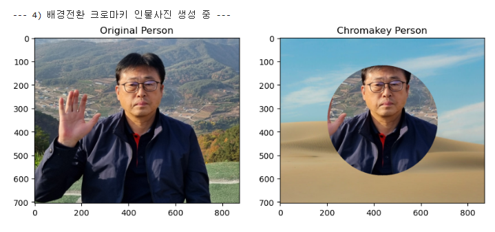
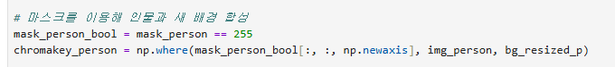
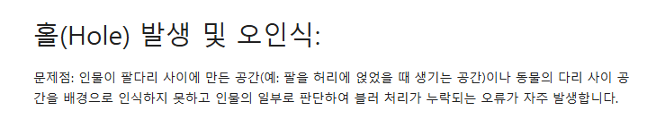

# AIFFEL Campus Online Code Peer Review Templete
- 코더 : 조희연
- 리뷰어 : 정슬기

# PRT(Peer Review Template)
- [x]  **1. 주어진 문제를 해결하는 완성된 코드가 제출되었나요?**
    - 주어진 문제에서 요구한 인물모드 사진 제작, 동물 사진 아웃포커싱,
    - 배경전환 크로마키 사진 제작이 모두 구현되었습니다.
        - 특히 np.where()를 사용하여 mask가 255인 영역은 원본 이미지를 유지하고,
        - 그 외의 배경 영역은 blur 이미지 또는 새 배경 이미지로 교체하는 방식으로 최종 결과물을 만들었습니다.
        - 

- [x]  **2. 전체 코드에서 가장 핵심적이거나 가장 복잡하고 이해하기 어려운 부분에 작성된 주석 또는 doc string을 보고 해당 코드가 잘 이해되었나요?**
    - 핵심 함수인 get_segmentation_mask()에 docstring이 작성되어 있어 함수의 목적을 이해할 수 있었습니다.

해당 함수는 이미지를 입력받아 DeepLabV3 모델을 통해 segmentation mask를 생성하고,  
arget_type이 person인지 animal인지에 따라 필요한 영역만 이진 mask로 반환하는 역할을 합니다  
이 함수가 중요한 이유는 이후의 아웃포커싱과 크로마키 합성 과정이 모두 이 mask를 기준으로 이루어지기 때문입니다.

또한 코드 곳곳에 다음과 같은 주석이 작성되어 있어 전체 흐름을 이해하는 데 도움이 되었습니다.

배경 blur 처리 부분
mask를 이용해 인물과 blur 배경을 합성하는 부분
크로마키용 새 배경 이미지를 원본 사이즈에 맞게 resize하는 부분
mask가 255인 곳은 원본, 0인 곳은 blur 배경을 사용한다는 설명

- [x]  **3. 에러가 난 부분을 디버깅하여 문제를 해결한 기록을 남겼거나 새로운 시도 또는 추가 실험을 수행해봤나요?**
    - 네
    - 

- [x]  **4. 회고를 잘 작성했나요?**
    - 단순히 결과 이미지만 출력한 것이 아니라, mask 기반 합성 방식의 원리와 한계까지 정리한 점이 좋았습니다.
